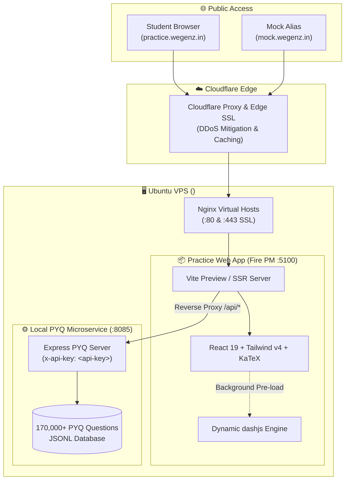
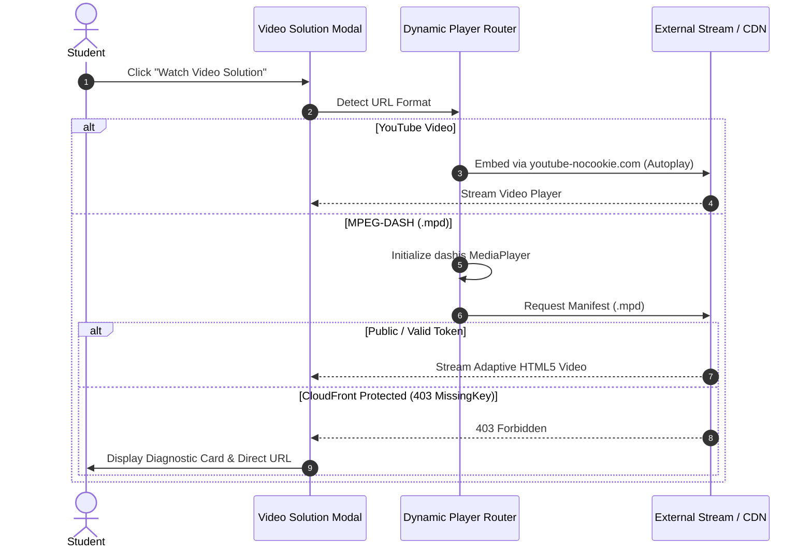

<div align="center">

# ⚡ Wegenz Infinite Practice

<p align="center">
  <strong>High-performance, standalone question practice and mock examination engine for JEE & NEET aspirants.</strong>
</p>

<p align="center">
  <a href="https://practice.wegenz.in">
    
  </a>
  <a href="https://mock.wegenz.in">
    
  </a>
</p>

<p align="center">
  
  
  
  
  
  
</p>

</div>

---

## 📖 Overview

**Wegenz Infinite Practice** is a dedicated, zero-distraction test and practice platform designed specifically for competitive exam preparation (JEE Main, JEE Advanced, and NEET). Powered by a comprehensive curated archive of over **170,000+ past year questions (PYQs)** from national entrance examinations, it provides unlimited custom test generation, granular subject/chapter filtering, formula-perfect KaTeX typesetting, and comprehensive performance analytics.

> [!TIP]
> Built for serious aspirants with a distraction-free, zero-latency interface — featuring authentic CBT exam simulation, keyboard shortcuts, formula-perfect KaTeX typesetting, and instant step-by-step video solutions.

---

## 🏛️ System Architecture



---

## ✨ Key Features

<table>
<tr>
<td width="50%" valign="top">

### 🎯 Track Selection & Question Allocator
- **Multi-Track Support**: Native batch tracks for `11th JEE`, `12th JEE`, `11th NEET`, and `12th NEET`.
- **Multi-Subject Chapter Picking**: Simultaneously select chapters across Physics, Chemistry, and Mathematics/Biology.
- **Custom Split Modes**: Choose between equal automatic question distribution or custom per-subject steppers.
- **Flexible Test Sizing**: Generate sets ranging from 5 to 100 questions.

</td>
<td width="50%" valign="top">

### 📐 KaTeX Mathematical Typesetting
- **Formula Rendering**: Sanitized LaTeX and MathML parsing with `katex/contrib/auto-render`.
- **Chemical Reactions**: Full support for complex chemical equations ($\text{CO}_3^{2-}$, $\text{HNO}_3$, enthalpy balances).
- **Sub/Superscripts & Fractions**: Flawless formula rendering in questions, answer options, and step-by-step solutions.

</td>
</tr>
<tr>
<td width="50%" valign="top">

### ⏱️ Exam Pressure Timers & Pacing
- **Configurable Countdowns**: Set per-question timers (60s, 120s, 180s) or practice without limits.
- **Pacing Analytics**: Tracks exact milliseconds spent per question and calculates average solving pace.
- **Auto-Advance & Submission**: Automated transitions upon timer expiry to simulate actual CBT exam conditions.

</td>
<td width="50%" valign="top">

### 🏆 Interactive Results & Error Analysis
- **Adaptive Performance Tiers**: Tier badges based on accuracy ($\ge 80\%$ Outstanding, $50-79\%$ Good Effort, $< 50\%$ Keep Practising).
- **Selection Comparison**: Highlights chosen answers against correct answers with color-coded badges.
- **Interactive Jump Palette**: Numbered pills with target focus rings to jump smoothly to any question.
- **Filter Tabs**: Instant review filtering for `All`, `Correct`, `Incorrect`, and `Skipped`.

</td>
</tr>
</table>

---

## 🎥 In-Page Video Solution Modal

When reviewing test solutions, clicking **"Watch Video Solution"** opens an in-page modal without leaving the review workflow:



> [!TIP]
> The `dashjs` video engine is automatically prefetched in the background when you land on the completion screen, ensuring zero-latency startup when you click on video solutions.

---

## 🚀 Getting Started

### Prerequisites
- Node.js $\ge 18$
- [pnpm](https://pnpm.io/) $\ge 9$
- Running PYQ Microservice on port `8085`

### 1. Installation

```bash
# Clone the repository
git clone https://github.com/Fire162/practice-wegenz.git
cd practice-wegenz

# Install dependencies
pnpm install
```

### 2. Local Development

```bash
pnpm run dev
```
Access the development server at `http://localhost:5100`.

### 3. Production Build & Verification

```bash
# Typecheck
pnpm run typecheck

# Compile production bundle
pnpm run build
```

---

## 🛠️ Production Operations

### [Fire PM](https://github.com/Fire-Package/fire-pm) Service Management

The application runs as a daemonized system service managed by **[Fire PM](https://github.com/Fire-Package/fire-pm)**:

```bash
# Start the service
fire start /root/practice-wegenz/start.js --name practice-wegenz

# Check service status & metrics
fire info practice-wegenz

# Restart service after updates
fire restart practice-wegenz

# View live journals
journalctl -u fire-practice-wegenz.service -f
```

<details>
<summary><strong>🌐 Nginx Reverse Proxy Configuration</strong></summary>

Virtual host file at `/etc/nginx/sites-available/practice.wegenz.in.conf`:

```nginx
server {
    listen 80;
    listen [::]:80;
    listen 443 ssl;
    listen [::]:443 ssl;

    server_name practice.wegenz.in mock.wegenz.in;

    ssl_certificate /etc/letsencrypt/live/chopology.store/fullchain.pem;
    ssl_certificate_key /etc/letsencrypt/live/chopology.store/privkey.pem;

    access_log /var/log/nginx/practice.wegenz.in-access.log;
    error_log /var/log/nginx/practice.wegenz.in-error.log;

    location / {
        proxy_pass http://127.0.0.1:5100;
        proxy_http_version 1.1;
        proxy_set_header Upgrade $http_upgrade;
        proxy_set_header Connection "upgrade";
        proxy_set_header Host $host;
        proxy_set_header X-Real-IP $remote_addr;
        proxy_set_header X-Forwarded-For $proxy_add_x_forwarded_for;
        proxy_set_header X-Forwarded-Proto $scheme;
    }
}
```

Reload Nginx after modifying configuration:
```bash
sudo nginx -t && sudo systemctl reload nginx
```

</details>

<details>
<summary><strong>☁️ Cloudflare DNS Configuration</strong></summary>

Both domains are proxied through Cloudflare with automated edge SSL certificates:

| Record Type | Hostname | Destination IP | Proxy Status |
| :--- | :--- | :--- | :--- |
| **A** | `practice` | `<your-vps-ip>` | ☁️ Proxied |
| **A** | `mock` | `<your-vps-ip>` | ☁️ Proxied |

</details>

---

## ⚖️ Disclaimer & Fair Use

This project is an open-source, non-commercial educational tool developed strictly for personal academic study, revision, and examination practice.

* All past examination questions, syllabi, and related curriculum references belong to their respective examination conducting authorities (NTA, IIT Joint Admission Board, CBSE).
* All referenced educational marks, step-by-step methodologies, and third-party resources remain the property of their respective copyright holders.
* If you are a copyright holder and believe any content should be modified or removed, please open an issue or contact the repository maintainers.

---

## 📄 License

This project is licensed under the [MIT License](LICENSE).
